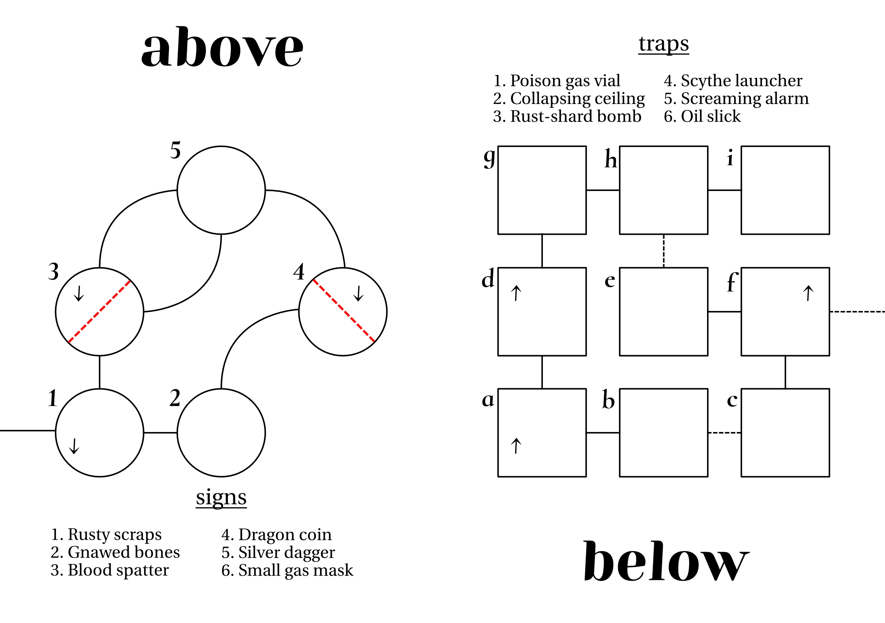

<iframe frameborder="0" src="https://itch.io/embed/1833436" width="552" height="167"><a href="https://jasonwardell.itch.io/kobolds-in-the-equipment-graveyard">kobolds. in the equipment graveyard by jason wardell</a></iframe>

## Hooks
Old Rancher Ralth stumbled into the supply depot three days back, bloodied and more taciturn than usual. He threw a sack of small, dragon-minted silver onto the register and walked out with a pitchfork, a big length of rope, and a jug of lantern oil. "Got kobolds," is all he said on his way out, and neither he nor his family have been seen since.

Farms and ranches in the region have all reported small items going missing from their equipment stores. Likewise, children are losing toys at an alarming rate.

The young Ralth girl, Mora, never very personable, greedy, and often bullied, got in trouble at school before she went missing. She brandished a small silver dagger when shoved in the playground and refused to say where she found it.

## The Ranch
The ranch is operated by the patriarch, who everyone just calls "Old Ralth." His son, Nic, and daughter-in-law, Stasia, also live and work on the ranch with their daughter, Mora. The house and grounds are silent, save for the animal cries of hunger from the cowshed. At night, a small fire in the equipment graveyard among the windbreak trees, canid cackling, and a clatter of metal and wood splintering deeper.

### Equipment Graveyard
The kobolds only come above at night, keeping their passages below well-hidden. The chutes are steep and dark, and kobolds jumping down set poisoned spear traps within, with an audible click. A lever below dismantles the trap. 

The space below is excavated for small creatures, with most spaces reaching no more than 5 feet high. Passages between spaces are narrow, wide enough for one human to move through at a time. If alerted to intruders, the kobolds will trap the entrance to their room and wait in ambush.

#### Above
##### 1
In the first clearing in the woods, three kobolds laugh and stoke a small fire, upon which a steak sizzles. They are guarded but not immediately hostile. They claim to be simply camping for the night, no crime against that, not looking for any trouble, etc. You don’t see any tents or backpacks, but you do see several piles of metal and wood.

Instead of fighting, they retreat down a concealed burrow-chute. Nearby, a short length of rope is tied to a tree, cleanly severed.

- North: Smell of machine oil, sounds of hushed conversation.
- East: Flies buzzing, rotten meat.

##### 2
Amid decades of discarded grain sacks and oil drums, Stasia’s crumpled body, swarmed with flies. She has been dead several days, her body covered in numerous small, clean stab wounds. It looks like someone attempted first aid.

- North: Small grunts of exertion.
- East: Crackle of wood-fire, smell of cooking meat.

##### 3
A row of decommissioned farming equipment, stacked treacherously high, bisects this clearing. Two kobolds on the north side work to remove gears, springs, and blades. Confronted in any way, they jump into a concealed chute, shrieking, “They’ve come for the queen!”

- North & East: Corpse rot and quiet.
- South: Steak cooking on a fire. 

##### 4
Bisected by a wall of rusted metal beams, railroad ties, and barbed wire, four kobolds remove manageable pieces from the pile. Alerted, they sit in ambush on the north side. They take aim through small gaps in the wall with crossbows and, spotted, fire a single volley before retreating through a chute.

- North: Smell of death, eerie quiet.
- West: Flies recongregating.

##### 5
Nic’s body, slumped over a tree root. By his hand, a bloodied scythe. Throughout the clearing, at least five dead kobolds, many hacked into pieces. Among their corpses: six silver daggers, 6d6 silver coins, and one small crossbow with d6 bolts.

- West & South: Sounds of scavenging among machinery.
- East: Quiet curses, occasional clatter of metal against wood.

#### Below
##### a 
A severed rope at the bottom of a hastily-excavated and poorly-supported chamber. Three kobolds sort equipment pieces by type and condition, moving them north by cart.

- North: Distant chatter, faint tobacco smoke.
- East: Soft snoring, pleasant food smells.

##### b
Two lethargic kobolds doze surrounded by a mess of food scraps: bread heels, cheese rinds, steak gristle. Several lovingly-crafted gift boxes and bags sit atop a makeshift altar.

- West: Metal clanking, quiet high-pitched conversation.
- East: (behind a wooden wall painted to look like dirt), smell of fat cooking

##### c
A kobold chef prepares something resembling a grilled cheese sandwich. A deep pit in the floor, covered with a thin sheet, holds cold food stores including packages of bread and cheese, salted beef, fresh steaks. Some wrapped in bows and ribbons, gifts.

- West: Snoring.
- North: Periodic mechanical whirs, faint smell of a pleasant incense.

##### d
Well-organized mechanical parts and prepared lumber. At the center, partial chassis for articulated armor made of farming equipment. One set seems fit for a large quadruped and another set is vaguely human-sized. A barrow-chute terminates here.

*	Articulated Farmer Armor: One inventory slot, +2 AC and can be trashed to negate a single injury.

- North: Strong tobacco, jovial chatter.
- South: Sorting sounds.

##### e
Queen Mora, honorary dragon, sits on a hoard of silver coins and amassed toys in her perfumed and illuminated room, snacking and idly playing with a dragon doll. She's growing tired of playing queen and has nearly completed a small escape tunnel in the north wall

- East: Mechanical servos whir and click.
- North: (behind a heap of toys), faint smell of kobold excrement.

##### f
Two kobolds in heavy mechanized armor stand guard before the queen's chambers. They do not move from their post except to engage intruders. A crude banner depicting a wyvern-riding queen hangs on the east wall.  A barrow-chute terminates here.

- West: A child humming to herself.
- South: Cheese sizzling in a pan, a quiet voice cursing.
- East: (behind the banner, past a fake wall), distant bestial screams.

##### g
Five kobolds smoke and play cards. Many have large claw marks across their faces and bodies.
Among their effects, you find 10d6 silver, several gas masks, and a flute.

* Caballus Flute: Can be played to call the nearest horse, which will be friendly and amenable to taming.

- South: Quiet.
- East: Quiet. Beyond a door, the strong smell of kobold waste.

##### h
A shallow latrine dug into the earth. The smell is overpowering. Unless mitigated in some way, all rolls here by non-kobolds are with disadvantage.

- West: Kobolds at play.
- East: Quiet labored breathing.

##### i
Old Ralth, injured and dying, sits nestled among the kobolds’ digging tools, ready to strike with his pitchfork, a dead kobold beside him. He knows their shift and sleep schedules, but is too weak to keep looking for his granddaughter. 
- West: A horrid stench.

#### And then
Past the fake wall hidden by Mora’s banner, a much larger excavation leads to a clearing on the surface, where four kobolds struggle to keep a wyvern tethered. The beast is in terrible pain, saddled and strapped with armor and mechanical weaponry. 
