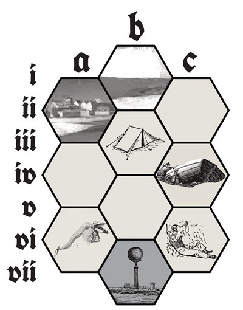
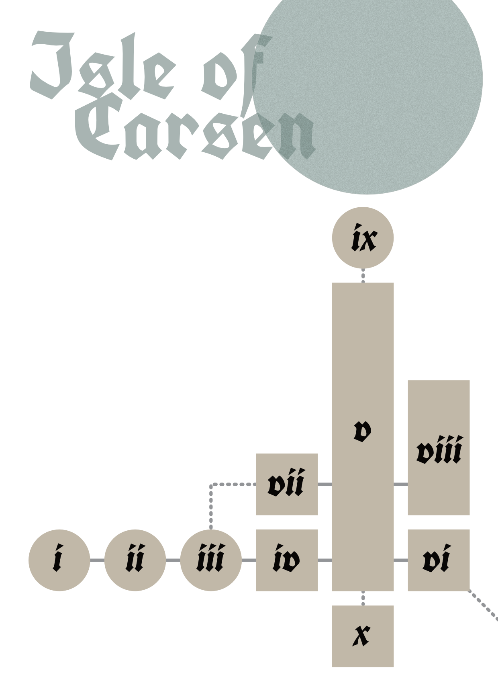

<iframe frameborder="0" src="https://itch.io/embed/1972016" width="552" height="167"><a href="https://jasonwardell.itch.io/stones-to-kill-the-sea">Stones to Kill the Sea by jason wardell</a></iframe>

## Hooks
The Synarchy of Tristia seeks capable adventurers to retrieve three stolen artifacts: **Seastones** believed to be held by the Artificer Quayvin at the Isle of Carsen

Hundreds have fled the harbor-town of Fulmar, each claiming a curse has stolen their sea.

A massive ecological disaster has crippled the Arch Druid of Barthe. The entire clan has expended their resources to keep them alive. Restore the collapsed ecosystem, and name your reward.

Approaching the edge of the Great Green Sea, you find nothing but a dry, saline basin. In the far distance, the lighthouse shines with a stunning turquoise glow.

## Great Green Sea

*Any hex not filled in is salt-crusted soil, littered with desiccated fish carcasses.*

* AII: ***Fulmar***. Harbor-side, its docks jut over the edge of the basin. Only the children know the way down.
* AVI: ***Skeletal Remains***. A massive sea beast, sun bleached and fossilized.
* BI: ***Fulmar Beaches***. A seaside resort, fully vacant. Dunes reclaim what's theirs.
* BIII: ***Sand-Surfing Hermit***. Can convert surfboards and teach you to surf the basin in trade for any kind of seafood.
* BVII: ***Isle of Carsen***. The island mesa looms above the basin. A swirling blue-green orb rests atop the lightouse, visible for leagues.
* CIV: ***Upturned Boat***. Beneath, two mummified corpses, fishing supplies, and plenty of dried and salted fish.
* CVI: ***Jetstone Quarry***. Clean bore-cut tunnel, 15 ft. wide, deeper than you can imagine. 1 in 6 chance of an Automaton.

### Loot
1. Fishing spear & net
2. Shard of Jetstone
3. Locked treasure chest
4. Tristian tabard
5. Tinder box
6. Empty water skin

### Basin Encounters
1. Salt Elemental
2. 2d6 Carrion Buzzards
3. Salamander
4. 3d6 Tygerflies
5. Molar Worm
6. Roll again. On 6, Jackalope

## As long as they've known it, men have tried to own the sea and all that it hides.

## Isle of Carsen

### Automata
1HD. 2AC. Club/Club or Electric Discharge (test Dexterity or Paralyzed for 1 Round). 9S. 1d6 appearing.

Headless, dog-sized mechanical servitors, powered by a small wafer of **Jetstone** slotted into their upper back. They speak and understand two-word phrases. Usually in *Work Mode*, they can shift to *Defensive Mode*, where they fight to protect Quayvin, the Lighthouse, and themselves, in that order.

Upon entering *Defensive Mode*, they alert any Automata within one room, who arrive in 1d6 Rounds.

Commands given to Automata are met with the response: *Authority Missing*.

### i. Docks
The easiest way up to the island: a gentle sea shelf leads to an eroding sandy shore. Beached seacraft lay around in various states of collapse and decay. At the base of a long jetty, a corpse wearing a full **Diving Bell**. Removed, the body dries and withers within minutes.

A **Tristian Sloop** sits in dry docking. The whole of the sea, condensed in an orb, hovers above the lighthouse at the top of the hill.

### ii. Warehouse
Hundreds of Automata sit inert in rank and file, all covered in a thick layer of dust, an empty slot in their backs awaiting **Jetstone**. The wooden structure of the warehouse is brittle, audibly cracking and splintering if jostled.

### iii. Guard Post
Abandoned, save for a dead and withered guard in Tristian garb, dried crepe paper skin curled and peeling, body bludgeoned and with branching, tree-shaped burn scars. Your own skin feels drier, and your mouth and eyes seem unable to hold their moisture.

An unlocked gate leads to the lighthouse's approach. For the first time since reaching the Great Green Sea, you can hear waves. They sound like they are all around you.

A frail figure waves from the second floor lighthouse balcony, directly above the path. You can't make out any words they say, but they beckon you to the entryway.

### iv. Antechamber
One Automaton attends the entry chamber, inviting you to *Please Wait* in the inviting and posh lounge. A dead Tristian emissary, mummified and with no signs of struggle, occupies a chaise. He carries manacles, a writ of arrest (5,000 Gold for the Artificer, alive), and a **Potion of Paralysis**.

The Automaton flits around the room in a rhythmic step, humming with a melodic tune. It produces a glass for each party member, filling it from a chilled pitcher, imploring *Sit. Drink.* and enters *Defensive Mode* if they attempt to leave without Quayvin escorting.

The liquid is **Odorless Poison**. Test Luck or die.

### v. Stairway
Aridity pervades the tall winding stairway to the top of the lighthouse. By the dust throughout, nothing has passed through here in months. Periodic stone clatter and the melodic hum and rhythmic clicking of Automata can be heard behind a door to the East.

A hidden panel in the floor reveals an interface for an Automaton to control. A landing 15 feet up has doors to the East and West. The stairs terminate 130 feet up in a solid ceiling, with no obvious way through. Replicating the hum and rhythm of an Automaton opens the passwall.

### vi. Workshop
Three Automata futilely try to keep piles of **Jetstone** from toppling. Just as they right one, another collapses. The stone wafers are remarkably heavy for their small size (each takes an Inventory slot). To an Artificer, a half-dozen would fetch 1,000 Gold or a trip to a torture chamber until you reveal where you found them.

The Automata enter *Defensive Mode* if you try to take any. A hidden tunnel descends hundreds of feet into the Quarry.

*From the second floor and above, all water streams toward the **Seastone**. Sweat tugs against the surface tension of your skin, traveling up and away from your body.*

### vii. Bedchamber
In his stately room, the Artificer breathes shallowly, slumped over his desk, his skin dry and flaking off in sheets. Not an old man, he is deeply drained of water, eyes blooded and jaw hanging open, his heavy necklace pulling his neck down. Unable to speak, he mouths the word "water."

Given a waterskin, he sticks the opening in his mouth before opening it. All the water within flows through the air, across the balcony, and up to join the **Seastone** above. Straining, he manages a large gulp before it's gone. He croaks the words: "They sing. They dance. They ascend."

He wears a **Jetstone Necklace**, which provides authority to call and command the Automata. After the party leaves, he calls for one to carry him downstairs to *Open Vault* but he will not be able to speak the command.

### viii. Library
A magnificent two-story reading room, lined with tall shelves, home to thousands of books on the subjects of artifice and wizardry. The room is watched by four Automata, who nimbly scale the walls carrying improbably-large stacks of books, maintaining the same rhythmic step and hum. All the tomes here are badly dehydrated, crumbling to dust if opened.

One book sits open in a marble stand, badly warped and flaking. It can convey one **Spell Word** with an hour of uninterrupted study.

2d6 Automata arrive in *Defensive Mode* if any books are damaged.

### ix. Apex
Beyond the passwall, four especially large Automata (3HD. 3AC. +1 Damage) hold the engorged **Seastone** aloft with a field of energy. The powerful aura of the stone pulls ruddy brown sweat to the surface of your skin, stripping the water within. 

Every Round spent in close proximity to the stone, Test Strength or take d6 damage. One killed in this way shrivels to a husk in minutes, all bodily water erupting with no will to keep it contained.

One Automaton immediately enters *Defensive Mode* when the party breaches the passwall unless they carry the **Jetstone Necklace**. The remaining three can hold the **Seastone** on their own for 4d6 Rounds.

Destabilized, the **Seastone** ruptures in 1d6 Turns. It looses the sea, destroying all structures upon the isle. When the waves reach Fulmar, it will surely be enveloped.

### x. Vault
A sealed, waterproof metal chamber beneath the lighthouse, with enough air for one day for a single occupant. Its treasure: two blue-green **Seastones**, scrawled with gold sigils and wards in an unknown arcane language, each no larger than a plum.

The third will be among the rubble of the devastated island.

## What hubris they have. All men are made of water eager to return.
