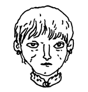
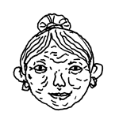
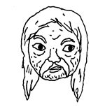
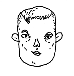
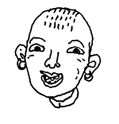
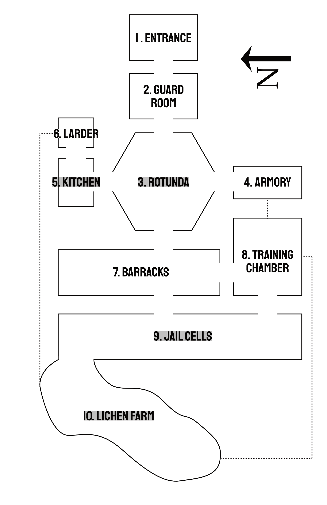
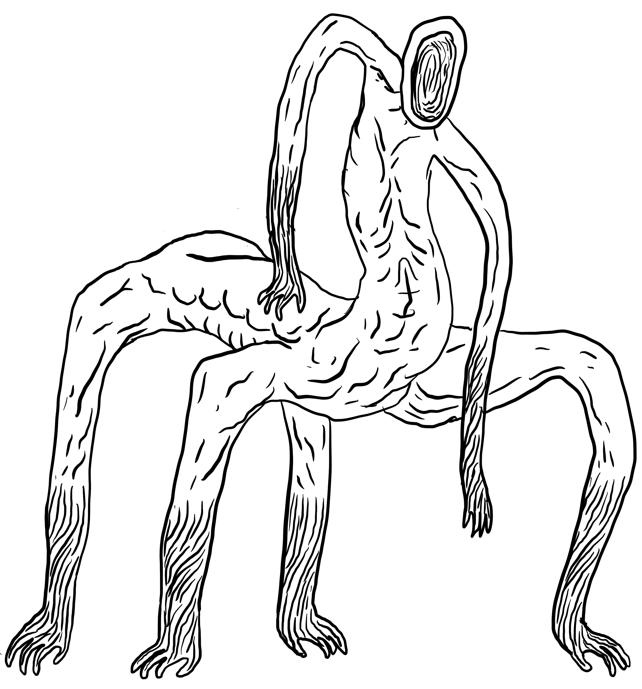
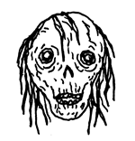
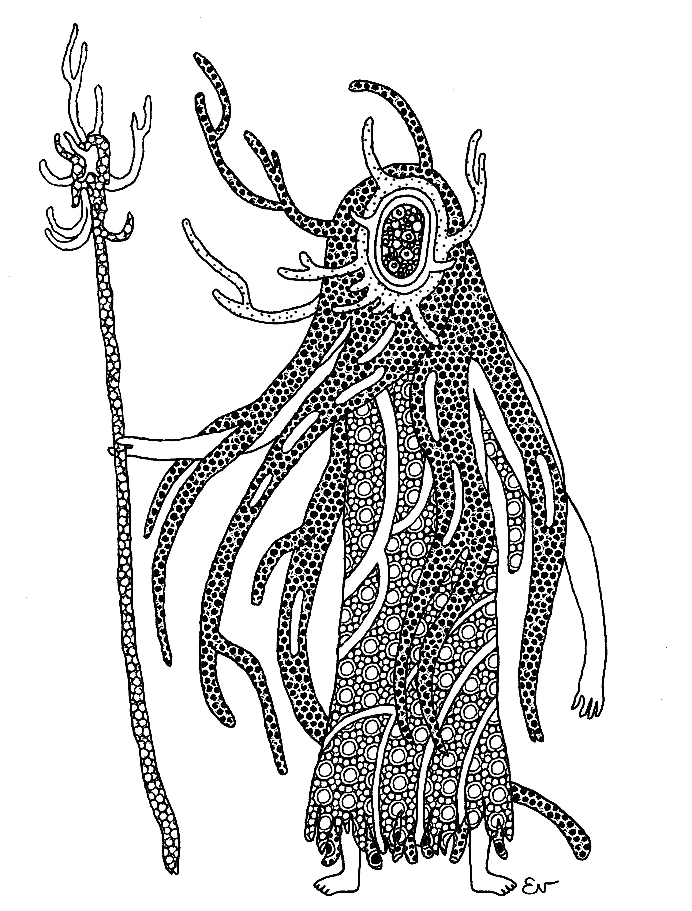

<iframe frameborder="0" src="https://itch.io/embed/1193059?linkback=true" width="552" height="167"><a href="https://jasonwardell.itch.io/the-dungeon-near-the-shadow">The Dungeon Near the Shadow by jason wardell</a></iframe>

## Introduction
The persistent suborbital occlusion sits writhing in the west. It dropped from the heavens, some say, or maybe it bubbled out of the ground or burst out of the space between air, three years past. Some call it the "Shadow" for how it negates the light, drowning everything it covers in opaque darkness. 

The sun no longer sets in the west: it disappears into the Shadow, and each evening you can hear prayers at every hearth that it returns unchanged the next day. Most things that enter the shadow do not return, and if they do, they are seldom unchanged.

**THE DUNGEON NEAR THE SHADOW** is a low-level horror-flavored adventure for the tabletop role-playing game of your choice. It refers to many standard elements across simple systems—hit dice, armor value, saves—but if your system does not use these mechanics, you should find a suitable substitute that maintains a vibe of _creepy, weird, & dangerous._ For this document, I've used stats for [The Vanilla Game](https://vanillagame.carrd.co/) by Jared Sinclair.

Words and design by [Jason Wardell](https://jasonwardell.itch.io/), September 2021. Revised November 2022.

Character portraits by [Evlyn Moreau](https://www.patreon.com/evlynmoreau/).

Art and text may not be reused. All artists maintain copyright of their work.

When it comes our time to change, may we be led caringly into that terrifying unknown, and may we learn to do the same for those who come after.

## Krotak
The town of Krotak is the last town before the shadow overtakes the western lands. Despite its proximity to the cursed occlusion, it is a thriving and peaceful place. When the shadow emerged, it wholly enveloped the seat of power for the Tyrant King Lyrica, effectively liberating the fertile farmlands at the outskirts of his domain. The farmers and tradespeople who were so commonly subjected to his cruelty built up Krotak as an independent community, and it has blossomed into a tight-knit and self-sustaining settlement.

Arriving, perhaps to investigate the utter collapse of a powerful continent-spanning empire, perhaps out of curiosity for the supernatural occurrence that effected it, one finds Krotak to be an insular community. Outsiders are greeted with thinly-veiled suspicion and a bare minimum of hospitality.

### Townsfolk
  

1. **Cassidy** (she/her) - 3HD, 6AC, Longsword  
A stern, towering former soldier of the Tyrant King, now serving as a blacksmith's apprentice. She defected when the Shadow emerged, abandoning her assigned post at the dungeon situated just outside of the occlusion. She is mournful for former comrades who chose to remain loyal.  
  
_"We weren't all bad. Some of us strove to make things better... Not all of them deserved to die. Many did, but not all. I should have done more to help."_

  

2. **Anemone** (she/them) - 1HD, 2AC, Spellbook containing _Web_, _Sleep_, and _Detect Magic_.  
An ageless, always-smiling merchant who claims to have a trade route through the lands under Shadow. She notes with grim sincerity that it takes one week by horse to clear, past the abandoned kingdom, and out to the coast and blessed light.  
  
_"There are some in there... wouldn't call 'em people anymore. They don't want for traditional wares. Sorry wretches; best to leave 'em be and keep moving."_

  

3. **Graham** (he/them) - 2HD, 4AC, Holy Symbol, _Cure Light Wounds_, _Purify Food and Drink_.  
A hunched and rosy-cheeked former healer, who trekked into the Shadow in the early days to recover survivors. Returned alone after a week and hasn't left the tavern since. They don't talk about it, only drink, but welcome company while doing so.  
 
 _"Another."_

  

4. **Ashen** (he/him) - 3HD, 2AC, Noxious Censer, _Speak with Fungi_.  
A doomsday prophet who draws a small audience every day in Krotak town square. He claims to speak on behalf of the Shadow, promising that the Tyrant King's fall was just the beginning, and soon the world entire will be enveloped. He is capable of speaking with the Changed.

_"The time is at hand when you—all of you—will account and live eternally in pain and suffering under the great cleansing darkness!"_

  

5. **Karin** (they/them) - 3HD, 4AC, Sickle, Spear  
A tanned, middle-aged farmhand, who used to have a large tract of family land that is now fully encompassed by the Shadow. They have nightmares of a beast with the face of the former King prowling the borderlands.

_"Having that warmongering despot on our door was miserable. I try to not think about it; we're better off now in nearly every way."_

  

6. **Bert** (she/her) - 2HD, 2AC, Cudgel, Good Booze  
A lean, barb-tongued tavern owner who is furious at having a family heirloom—a floral locket—stolen amid a recent wave of burglaries. She knows everyone in town and is looking for excuses to pin the crime on someone.

_"See where you get when you cross your barkeep. See where you get."_

### Other Rumors
1. **False** - _"Tonight, keep an ear to the west. There've been heavy drums almost every night—war drums, I reckon. Listen, and you'll hear them!"_
2. **False** - _"I swear that shadow has been blooming and stretching. Just the other day, it was sprouting arms and I'm sure it would've caught me if I didn't hightail it."_
3. **False** - _"The Tyrant King is alive and heading for Krotak! He's got a whole regiment in the dungeon and it's only a matter of time before we're subjects again—or worse."_
4. **True** - _"A week back, I saw a flicker of light at the mouth of that damn dungeon. Spooked my horse good, and me, too, if we're being honest. Haven't seen it since, though."_
5. **True** - _"Those people, those changed things in the Shadow look creepy, but they're harmless. Mostly eat bugs and moss to survive, too weak to hunt or scavenge anything else."_
6. **True** - _"The Shadow is toxic in a way, y'know. Contagious. Spend too long in it, and you'll change, too."_

## Shadow
The pulsing miasma of Shadow looms at the edge of the landscape west of Krotak. From the fields and pasture surrounding the town, it is as a smooth grey-black stone placed atop the land. At the perimeter, there is a small weather-beaten stone structure, half-covered in Shadow: the entrance to the dungeon.

The air is noticeably thicker in the Shadow. Humid and stale, there is a substance one can feel on the skin, in the eyes, in the lungs. Even with a light source, visibility is halved, torches slinking away from the darkness. 

Upon coming into contact with Shadow, and for every Watch spent within, a character must Save against its corrupting effects. Following three consecutive failed Saves, the irreversible Change begins. Gain one level of Shadow corruption for every further failed save against Shadow.

| Level | Shadow Corruption                                                                                                                                                                      |
|-------|----------------------------------------------------------------------------------------------------------------------------------------------------------------------------------------|
| 1     | It's a little easier to see in the Shadow, a little harder to tolerate bright lights.                                                                                                  |
| 2     | You can see perfectly in the Shadow. Leaving it causes pain and confusion. All attributes, attacks, and saves are at -2 outside of the Shadow.                                         |
| 3     | You will do anything you can to avoid any light and become violent when faced with it. Attributes, attacks, saves at -5 outside Shadow.                                                |
| 4     | Your skin takes a pale, translucent tone, your hair thins, you stop eating and drinking. Grit can no longer be recovered by any means.                                                 |
| 5     | Exposure to light causes 1 Flesh damage per turn. You can smell edible fungus and moss, and are drawn to it.                                                                           |
| 6     | You are too weak to stand, think, or weep, but you cannot die unaided. Even if exposed to light for a prolonged time, you will only howl in unnatural pain, never succumbing to peace. |

## Dungeon
The small outbuilding is the only part of the Dungeon visible from outside the Shadow, its banded wooden door slightly ajar, the twin flanking guard posts long abandoned. 

There are no light sources in the Dungeon.

### Map

### Encounters
Each Turn, there is a 1 in 6 chance of an encounter. The Shadow Beast and Shadow Keeper only appear once, in a randomly-determined room.

| # | Encounter          |
|---|--------------------|
| 1 | Shadow Beast       |
| 2 | 1d6 Changed        |
| 3 | 1d6 Changed Beasts |
| 4 | 1d6+1 Townsfolk    |
| 5 | Patch of Shadow    |
| 6 | Shadow Keeper      |

#### Changed
1HD, 0AC, 1d4+2 Shadow Corruption, Attacks at 1d6-1. 

Pitiful, pallid, and endlessly on the precipice of death, they suck at moss and lichen at the corners of the dungeon walls. Most have shed their Soldiers' armor and are too weak to bear arms. 

Automatically Hostile if exposed to light.

#### Changed Beasts
2HD, 2AC.

Shadow-altered canids seeking greater sustenance than moss. Will eat other Changed creatures if desperate. 

Most have clawed their own eyes out and are not affected by light in the same way as Changed people. 

#### Patch of Shadow
0HD, Save vs. Shadow to destroy with fire 

Throughout the bunker, loose clouds of Shadow break free and roam, seeking host. They congregate around the Changed, but subtly move toward any uninfected in the room.

#### Townsfolk
1HD, 2AC, carry torches and simple weapons. 

The people of Krotak are suspicious of outsiders, especially in the recent rash of burglaries. Having grown complacent, they are not eager to return to lives encountering adventurers, travelers, and kings.

#### Shadow Beast
  

4HD, 5AC, Attacks twice at 1d6+1, Save vs. Shadow exposure on a hit.

A six-limbed monstrosity of knotted muscle and corporeal Shadow. Hunts the un-Changed and can sense them from 150ft away. Can move soundlessly through any amount of pooled Shadow, retreating this way if badly wounded. Only deterred by sunlight. 

Not a Changed beast, but something else.

#### Shadow Keeper
5HD, 3AC, Casts spells as a level 5 Magic-User. 

A faceless emissary wearing an amorphous robe of Shadow. Seeks out Changed to purify using an _Affinity With Shadow_ ritual, which reduces Shadow Corruption by 1d4, once per target. Automatically Hostile if they believe you have killed any Changed. 

Not a Changed person, but something else. 

### 1. Entrance
The small room was thoroughly scavenged shortly after the Shadow's arrival. Signs of a recent visitor—burnt logs, flint, scraps of bloody fabric—are roughly a week old. 

While the exterior of the dungeon's entrance is bisected by Shadow, there is none to be found inside. 

To the west, a broken iron gate followed by a stairway leading 25 feet down.

### 2. Guard Room
Pilfered armoires and chests flank the walls. A corpse, emaciated, Changed, lies crumpled in the center of the room, a crossbow bolt protruding from a sunken eye socket. 

No Shadow in this room.

To the west, an iron door, blocked. A good shove will clear the barricade, with a great clatter of collapsing stones and debris depending on the force of the effort.

### 3. Rotunda
An impressively tall domed chamber of worked marble, partially collapsed at the center. Four 10-foot statues of the Tyrant King stand in the ordinal directions of the room, all heavily vandalized and broken aside from that to the SE, which bears a jeweled crown (200gp, quietly opens an arrowslit to the Armory when removed).

A pooling column of Shadow fills a 15-foot span under the wrecked skylight. 

To the south, a locked banded wooden door with three festering purple gouges, head height. To the north, a closed wooden door and the quiet, steady buzz of insects. To the west, closed double iron doors with the Tyrant King's sigil.

### 4. Armory
On the various armor racks around the room, there are several full sets of heavy Imperial Armor (6AC, 60GP each), hastily doffed and strewn about. Earl, partway through his Change, waits in ambush among the mess. He fires his crossbow at the first person to open the door.

 

* **Earl** (he/him) - 2HD, 3AC, Crossbow, Dagger  
A brigand and outlaw from the east who fled to the one place he knew he wouldn't be followed. He pilfered small goods and food from Krotak in preparation for a Shadow-crossing. He is four days into his Change, and speaks of a multi-limbed beast that crawls through the Shadowy skylight of the Rotunda.

_"It leaves them alone but it'll come for you. It carries the Shadow with it. Now, end me; I've seen what I'm becoming."_

Earl claims the floral locket was taken from him in his sleep.

To the west, a hidden and locked door.

### 5. Kitchen
A large swarm of buzzing, biting flies pushes through the door when opened (Save or lose 1d6 Grit). The shelves and surfaces are empty, picked clean.

An open ventilation shaft above the large cook stove leaves only a narrow path not touched by Shadow. 

To the east, a hinged wooden door, the smell of rot and a periodic wet slurping, crunching noise. 

### 6. Larder
The cold food storage room is wildly overgrown with mold. Three Well-Fed Changed scrape at the walls with hands and teeth, devouring it and any scraps of food that might remain. They are only interrupted from this activity by exposure to light.

#### Well-Fed Changed
3HD, 0AC, 1d4+2 Shadow Corruption, Attacks at 1d6, Save vs. Force-Feed on a hit.

Much stronger than the other Changed due to their constant consumption of the fast-growing mold in the Larder. They target torchbearers first, attempting to extinguish any light. Once the torches are out, they try to force-feed their opponents fistfuls of mold: Save or succumb to the psychoactive substance for 1d6 hours, during which time you can take no actions other than gorging on the putrid mass.

To the north, hidden behind a wall of mold, a tunnel winds west. A half hour's crawl through moss spores and roughly-dug earth leads to the Lichen Farm.

### 7. Barracks
A long chamber lined with 10 bunk beds on either side. Weapons, armor, and personal belongings are scattered throughout the room, making movement difficult. Each bed has a 1 in 6 chance of containing a Changed, who will wake shrieking if disturbed—immediately check for a random encounter, which will arrive from an adjacent room. 

No Shadow in this room.

To the west, a double set of reinforced iron doors, barred from this side. To the south, a splintered wooden door, a low guttural groan.

### 8. Training Chamber
Three battered training dummies, two in heavy armor, stand along the east wall next to a 15-foot deep pit. The pit is obvious with any light source. At the bottom, two Changed corpses, each pierced with a crossbow bolt, and one barely-alive Changed pinned beneath them. A fetid blood moss (100GP per ounce to a necromancer) grows around their bodies.

No Shadow in this room.

To the west, a double set of reinforced iron doors, barred from this side. To the east, a hidden passage, revealed if a set of heavy armor is placed on the bare training dummy. At the bottom of the pit, the west wall is thin, and a solid blow would open a cavernous passage connecting to the Lichen Farm.

### 9. Jail Cells
Nine locked cells, several containing emaciated Changed. A major portion of the north wall is collapsed, and Shadow pools in from above, completely filling the corridor to the midpoint. 

To the north-west, through the Shadow, an open tunnel leads to a natural cavern, a low-pitch wordless chanting. To the north, the collapsed wall leads up and out into the Shadowlands. 

### 10. Lichen Farm
 

Filled with Shadow at the entrance, with 2d6 Patches of Shadow moving throughout.

In a far alcove of the cavern, five Changed sit huddled and chanting around Bert's locket (300GP, encourages fungal growth), the floral icon emitting a calming glow atop an abundant bed of green-grey lichen. These Changed are averse to light, but will not become aggressive or cease their chanting except under duress. Removing the locket ends the growth spell, but the bed of lichen remains lush.

The Lichen Farm is the destination of the Shadow Keeper, who has sensed the locket's power, and is seeking Changed to cast _Affinity With Shadow_ upon them and lead them to the Shadow commune of Umbra. 

The Keeper is neutral to un-Changed humans, unless it suspects they have killed any Changed, in which case it will fight mercilessly using high level magic. If pushed to surrender or if meeting a group of adventurers on positive terms, it will attempt to recruit them.

_"Most who have undergone metamorphosis are not nearly as strong as you. Would you accept the mantle of protector and scion? We would make your own journey as painless as possible, and you could still do great things in this world. Please consider it. Umbra would make it worth the sacrifice."_

## Epilogue
All who have Changed carry the seed of the Shadow. In untarnished soil, it burrows, it nestles, and it waits to be born.
