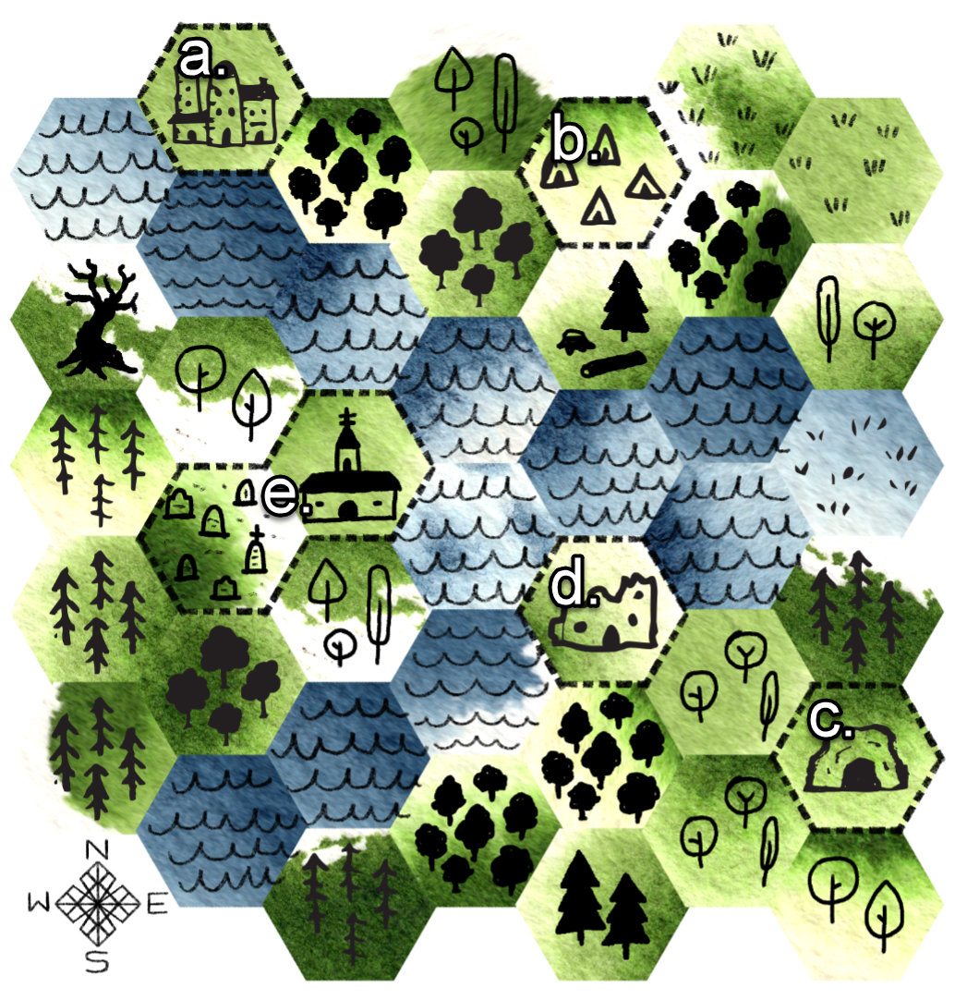

<iframe frameborder="0" src="https://itch.io/embed/1488193?linkback=true" width="552" height="167"><a href="https://jasonwardell.itch.io/the-riparian-forest-outside-south-kul">The Riparian Forest Outside South Kul by jason wardell</a></iframe>

## Frontmatter
THE RIPARIAN FOREST OUTSIDE SOUTH KUL is what I decided to call a "low-stakes" forest crawl. There's ostensibly an adventure in here and a hex map, but as with any pilgrimage worth a damn, there's the journey, and then there's the destination, and both are what you make of it. 

Originally written with stats for [CAIRN](https://cairnrpg.com/) by [Yochai Gal](https://newschoolrevolution.com/), it has always been intended to adapt to the minimal role-playing ruleset of your choice. For this iteration, I've used stats for [PILGRIMS OF MISFORTUNE](https://www.exaltedfuneral.com/products/pilgrims-of-misfortune-pdf) and/or [RODER](https://perchance.org/roder), both by [Nate Treme](https://hps.quest/), mostly because I want to run it in one of those systems soon.

Words and design by [Jason Wardell](https://jasonwardell.itch.io/), April 2022. Revised November 2022.

Forest Drake and Skeleton Maiden artwork by [Evlyn Moreau](https://www.patreon.com/evlynmoreau/).

Map tile art by [Nate Treme](https://natetreme.itch.io/hps-doodle-tiles) and [Adam Vass, World Champ Game Co.](https://worldchampgameco.itch.io/world-champ-hex-kit)

For the necessity of wilderness.

## Introduction
On a pilgrimage to the wayfarer's temple of St. Zabeth, out of communication with the greater world for the past ten years, you enter the riparian forest. The streams that feed into South Kul weave through the woodlands, playfully intertwining and dividing, dancing through thick patches of sacred trees and making a journey by foot a true struggle. Any roads that once led through the woods have since washed out or grown-over in disuse.

The words "plod" and "slog" become onomatopoeia as you step ankle-deep into yet another muddy pit hidden in the undergrowth. You know the temple to be to the south, visible in the far distance across the river.

Departing South Kul, you are warned that few leave by the southern gate and fewer still return.

The war missed South Kul, but it did not miss the forest.

## The Forest
### Map

|   | Location                        |
|----|---------------------------------|
| a. | South Kul                       |
| b. | Poacher's Camp                  |
| c. | Wolves' Den                     |
| d. | Ruined Fishing Lodge            |
| e. | Wayfarer's Temple of St. Zabeth |

 

### Random Encounters
For every watch spent in the wilderness, there is a 1 in 6 chance of a random encounter. Roll 2d6 and consult the table below.

| # | Number | # | Encounter       |
|---|--------|---|-----------------|
| 1 | 1d6    | 1 | Wolves          |
| 2 | 1d6+1  | 2 | Poachers        |
| 3 | 2d6    | 3 | Wild Pigs       |
| 4 | 2d6+2  | 4 | Mosquitos       |
| 5 | 3d6    | 5 | Sapling Spirits |
| 6 | 3d6+3  | 6 | Roll Twice      |

### Landmarks
It takes two watches to traverse one hex. This is no terrain for carts or horses. The river is wild and largely impassable without a boat, save for the reedy shallows to the east.

Upon entering a new hex, there is a 1 in 6 chance of it containing a landmark. Each landmark may only be discovered once.

  1. A hastily vacated campsite. One dead wolf. Four dead poachers.
  2. A lonely alder tree in a clearing, bubbling grey mushrooms. Test Frailty/Weak to eat one and talk with the tree, who hasn't had a good chat in a decade. The tree reveals a nearby cache containing an abandoned military uniform and rapier. On a failure, painfully retch the mushrooms up. The tree, embarrassed, will not speak with you.
  3. A clandestine distillery operation, with two survivalists creating a powerful, flammable, and disgusting spirit that restores 1d6 Vim and raises Clumsiness/Slow by 1. As you talk, mosquitos are drawn by the sugary wort, and the distillers slap wildly at their exposed skin.
  4. A patch of delicate purple-flowering shrubs, smelling sharply of vinegar. Nothing feeds on it. The petals may be brewed in a tea, which causes the imbiber to exude a similar smell and repel all insects for a day.
  5. The undergrowth is thick and labyrinthine. The trees will not take kindly to mutilation, beckoning Sapling Spirits to pilfer small items from the pilgrims' packs if they cut their way through. Clambering to a better vantage point is difficult, with many opportunities for grievous injury.
  6. Signs of digging among old, battle-scarred trees. A few feet down, large stones cover a pit with three decomposed bodies, each wearing a pristine military insignia, each holding a skeletal finger to their lips. 

## The Wolves
The first night spent in the forest, the wolves come. At first, just one or two of them, casing the pilgrims' encampment. They are large, but keep their distance and quickly slink away if approached. They return, eight in total, plus one mother.

When they approach their full numbers, they approach methodically. They begin looking for food ingredients, rations, and cooked meals, but do not hunt the pilgrims. When they've had their fill, they round up sturdy supplies—armor, weapons, tents—in a central spot and guard it.

They defend their finds and themselves. They growl and bare teeth if approached. They only fight to dissuade further violence, and will retreat before dying. They will ruthlessly avenge a fallen pack-mate.

When the supplies are gathered, the wolf-mother pads to the front, glowering. Her message is clear: "Go." The wolves allow the pilgrims to leave with the clothes on their back and the items in their hands.

### Encounters
**Forest Wolf** - 14 Vim, 5 Clumsiness/Slow, bite (d6)
  * Doubt/Foolish is 5 if Wolf Mother is alive and visible.

**Wolf Mother** - 20 Vim, 5 Frailty/Weak, bite (d8), howl
  * A foe who hears its howl must test Doubt/Foolish or be staggered for one round.

## The Poachers' Camp
Backed against the bluffs, two large braziers constantly burn green logs. The smell is acrid and offputting long before the camp can be seen. Twitchy guards, their faces masked in fabric, quickly raise bows at any who approach.

For years, they moved camp around the region, selling wares at South Kul and Latosh to the east, but for the past two weeks, they have been pinned down by aggressive wolves. Unable to hunt or forage, their supplies are low, and their first instinct will be to rob the pilgrims. They are sympathetic to any who have encountered the wolves and survived.

The camp hosts 16 poachers, with tents and equipment for 28. They hunt with shortbow and spear, each carrying at least one sharp knife. The camp is light on food, but abundant in pelts, bones, teeth, and trophies from poached animals.

Most in the camp are deeply demoralized, and have much to say about it:

  1. *"Get me out! Take me back to Kul, I'll pay for my crimes, you can have my bounty. It's worth your while! I just don't want to die out here."*
  2. *"This is Ricard's fault. He's the one the wolves want, and I say we give him to them."*
  3. *"They're just stupid wolves! How can we be afraid of dumb animals! Are we cowards?"*
  4. *"The smoke keeps the wolves away, but gods is it torture to breathe all day and night.*"
  5. *"It's the mother wolf holding a grudge. I saw the den just across the shallows; we go, we kill her, and that's that."*
  6. No response. A pained stare into the middle distance speaks for them.

Ricard is the leader, and the most composed of the poachers. He shares that he's been living in the wilderness since defecting from the army and witnessing the devastation of his home village by the Bolest military. He has been hunting and killing for profit for a decade. In that time, he amassed a following of outcasts and outlaws who live a comfortable nomadic life on the shore of a sea of spilled blood. 

*"How much do you know about the war that happened here? Children, this is no time for a pilgrim."*

Most of the poachers wish to leave, and could be persuaded to abandon this struggle against the wolves.

Ricard, alone, wishes to die.

### Encounters
**Poacher** - 12 Vim, 1 Armor, spear (d8) or shortbow (d6)
  * Deprived of food and sleep.

**Ricard** - 16 Vim, 2 Armor, daggers (d6, two attacks)
  * Fights dirty and can swap places with a nearby ally when attacked.

## The Wolves' Den
The wolf den hosts the family of nine, in addition to 23 humans the wolves have taken in. They are survivors from a bloody battle a decade ago: mothers, elders, and children. Many who were in their youth then are now coming of age.

The humans, though they don't speak much, speak adoringly of their wolf family. All are protective of all. In lieu of speech, small gestures: a glance, a snarl. They will continue to live among the wolves as long as they are able, and they are grateful to have a fresh stock of supplies. 

Ricard's mother is among them. She knows of the Temple and an old Fishing Lodge where the pilgrims might find a boat to cross the river. 

## The Ruined Fishing Lodge
Splintered planks and scorched beams jut over the river's edge in a tangle of vines and squat shrubs. Violence destroyed this place, and the hatred lingers like sulfur on the air. The forest here is uneasy and defensive, clouding away light and making every step precarious. It remembers the brutal men that were here last.

There is little to be found in the carcass of the lodge, so thoroughly ransacked it was in the battle. From the trees, branches crack and plummet. A the river's edge, footholds give way and drop into the roiling water. There is a presence here, and it becomes deadlier the longer the pilgrims linger.

Amassing out of the nearby foliage, mud, and slabs of moldering wood, the Woodrot Drake takes shape.

*"Destroyers,"* it whispers from a mouth of leaves and rot. *"You will pay for the pain inflicted here by your kind."*

The Drake is the manifestation of destruction and misery plaguing these woods. As it rears up to meet the pilgrims, the rushing waters reach a screaming pitch and the trees shake, buffeted by the ethereal storm.

Pacified, the waters calm and the canopy relaxes its hold over the sky. A ray of sunlight shines on a conspicuous mound of dirt, under which is a sturdy rowboat. Two can easily row together against the current; a pilgrim alone hasn't got a chance.

The river is wide and all too eager to sweep a boatful of heedless pilgrims downstream to the southwest and the ocean beyond.

### Encounters
**Woodrot Drake** - 25 Vim, 1 Armor, 4 Frailty/Weak, bite (d8, decay) and claw (d6)
  * A bite spreads rot to fabric and wood, causing it to decay over 1d6 rounds.

## Across the River
The vibrancy of the forest changes on approach. Whereas the woods had been green and in full bloom before, here they seem in perpetual autumn, frozen in the days before dying. Light filters through the trees, muted, and a hint of chill sits in the air. No wind: the leaves appear afraid to make a sound.

For every watch spent across the river, there is a 2 in 6 chance of a random encounter.

| # | Number | # | Encounter             |
|---|--------|---|-----------------------|
| 1 | 1d6    | 1 | Wolves                |
| 2 | 1d6+1  | 2 | Restless Dead         |
| 3 | 2d6    | 3 | Skeletons             |
| 4 | 2d6+2  | 4 | Thorn Spirits         |
| 5 | 3d6    | 5 | Sleep-Deprived Beasts |
| 6 | 3d6+3  | 6 | Roll Twice            |

The sun never truly rises or sets in this part of the forest, the golden hour stretching out in every direction. The plentiful fauna of the forest are skittish and unpredictable, stolen of their circadian rhythm. The dead roam the lands, playing out their cruel end in a perpetual loop of eerie silence.

### Encounters
**Restless Dead** - 4 Vim, 0 Armor, fists (d4, two attacks)
  * Restless Dead felled without purification rise again in 1d6 rounds, aggressive.

**Skeleton** - 10 Vim, 1 Armor, rusted sword (d6-1, infect)
  * Any damage dealt to Vim festers: test Frailty/Weak, gaining +1 on a failure until treated.
  * Skeletons felled without purification rise again in 1d6 rounds, aggressive

**Thorn Spirit** - 1 Vim, 2 Armor
  * Scatters thorns when agitated or slain, causing d4 damage when moving in the area.

## The Wayfarer's Temple of St. Zabeth, the Hushed
A hideous affront, the blasted remains of the traveler's temple sit atop a hill amid a horde of restless dead, the pockmarked land of upturned graves teeming with unlife. The church bell intermittently tolls, marking no specific passage of time, and signaling no change in the dead.

The curse holding this land emanates from the unholy temple. Most of the dead are not aggressive, sleepwalking through the end of days. The graveyard hosts 8d6 (reroll on 1 and 2) and the church grounds 6d6 (reroll on 1) Restless Dead. For each rerolled die, that number are automatically aggressive. Fighting attracts 1d6 Skeletons from a random direction.

Among the gravestones are numerous befouled and desecrated headstones. Atop one is a Relic: 
  * Silvertongue Necklace (+1 to persuasion)

Within the ruined temple, calm. Saint Zabeth, the Hushed, maintains some control here still. The story goes: Zabeth of Bolest, fourth daughter of a river-merchant and a teacher, was a talkative young woman. She wanted to know, wanted to share, and wanted to be heard. There came a time in a previous, previous war when loyalties were in question, and her eldest sister was overheard speaking critically of the Prime Commander. The inquisitors went to Zabeth, expecting her to talk, but she refused to give up her sister. She stayed hushed through a week of torment, and was ultimately executed for her silence. Her sister lived and fomented a rebellion, and Zabeth was canonized for her steadfast faith and loyalty.

The Sisters of Zabeth take an oath of silence and service to those who resist tyrannical power. This was not met with kindness when the new Bolest Military arrived, a decade past, a new war afoot.

The spirit of Saint Zabeth, the terror of her martyrdom, and the rage at her disciples' slaughter gives restlessness to the dead here. When the tower bell ceases ringing, night falls, and she manifests as a skeletal giant in the courtyard, plunging a sword of distrust and vengeance into the earth.

### Encounters
**Avatar of St. Zabeth** - 35 Vim, 2 Armor, 4 Doubt/Foolish, greatsword (d10), Spellbook (*Raise Dead, Hatred, Silence*)
  * Moves without a sound, never communicates by speech.
  * Max damage dealt by her greatsword permanently steals her target's voice.
  * Her sword, an implement of war, is inherently cursed. Peace in the forest will never come through war.
